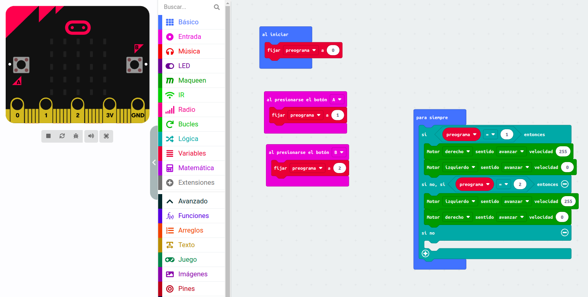

# Modulo 3

## Actividad 1

- En esta actividad vemos como programar movimiento mediante variables

## Actividad 2

- Tendremos que hacer que de una vuelta de 180º
- [video](https://www.youtube.com/shorts/Az_h9sKyvoQ)
