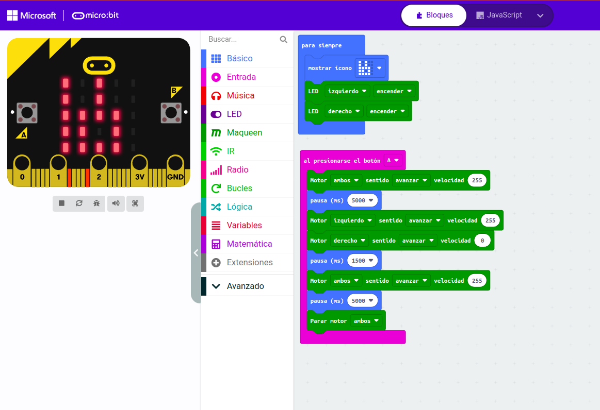

# Modulo 3

## Actividad 1

- En esta actividad vemos como programar movimiento mediante variables

- [video](https://youtube.com/shorts/VhWH9_oMXEw)

## Actividad 2

- Tendremos que hacer que de una vuelta de 180º

- [video](https://www.youtube.com/shorts/Az_h9sKyvoQ)
