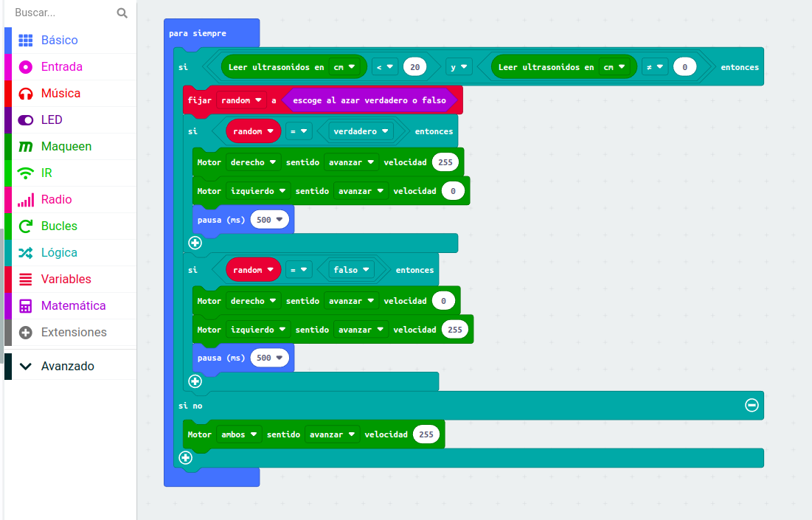

# Esquiva

- A qui veremos un pequeño codigo de maqueen para que este cuando detecta algo con el sensor de ultra sonido cambia de direccion

- Y el [video de demostracion](https://youtube.com/shorts/6HOV_C6Ylqk)
