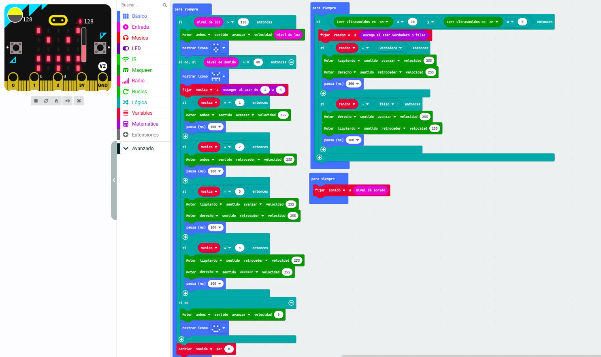

# El Vecino a las 3 de la mañana

- Este es mi mini proyecto para el robot maqueen, es basicamente sigue hacia delante si detecta luz y si no da vueltas a la izquierda o la derecha,
enfuncion de la variable que se randomiza, luego si escucha musica se vuelve loco

-Y aqui el [video explicativo]()
